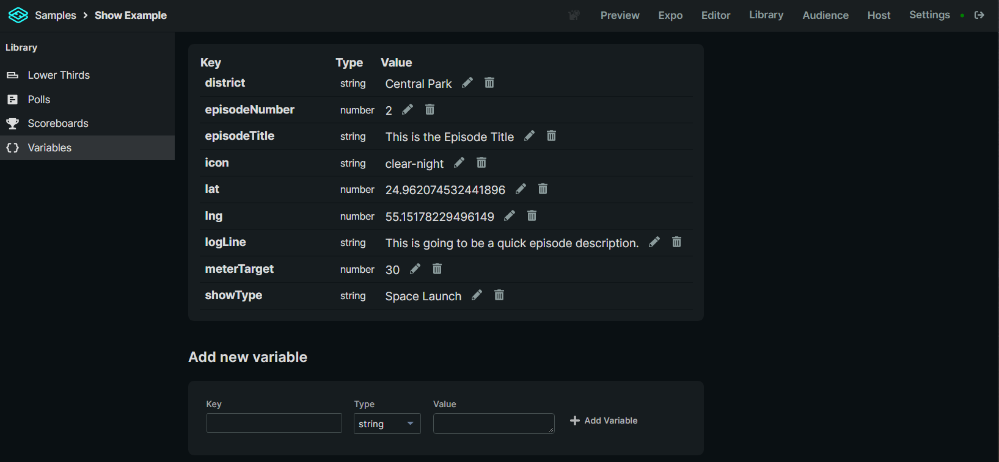

# Variables

Variables are strings, integers, or objects that can be updated via webhook and used within the content portion of a widget. They are comprised of:&#x20;

* **Key:** What is referenced when using the variable in a widget.&#x20;
* **Type:** What kind of data is used in the variable. Either string, integer, or object.&#x20;
* **Value:** The data used within the variable.



**Using a Variable within a Widget**


To use a variable within a widget use a Template Tag with the variables key within the brackets.&#x20;

```
{{variableKey}}
```
