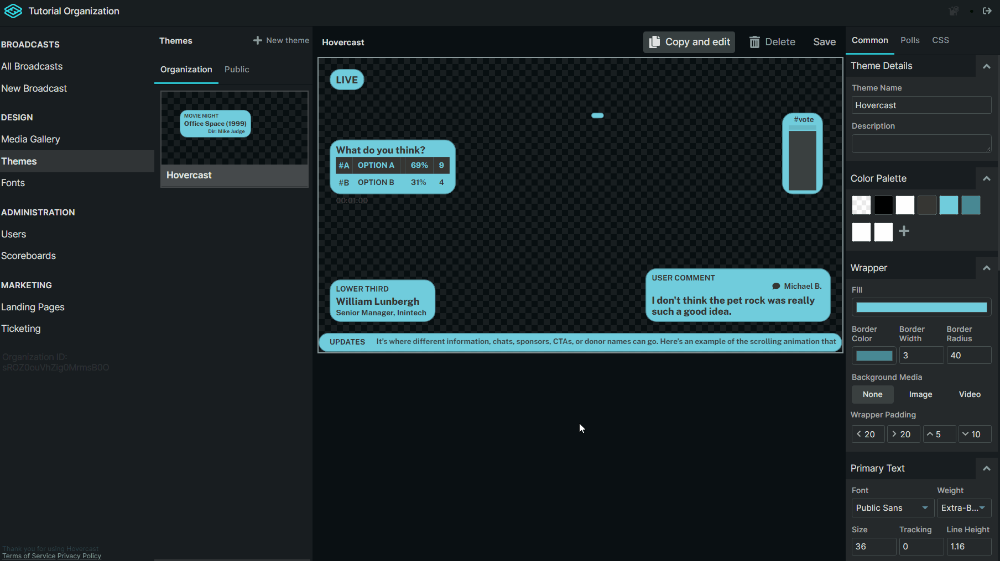

# Managing and Creating Themes

Themes apply a general style composed of fonts, and colors across all widget.

To view your themes navigate to the Organization page and click the Themes tab.&#x20;

## **Theme Categories**

There are two categories within the Themes Tab:

* **Organization Themes** - Are themes created by members of your organization
* **Public Themes** - Themes created by other users that are available to use.&#x20;


Public Themes **** are **not editable**, but clicking the **Copy and Edit** button will duplicate the theme into your Organization allowing you to modify it. &#x20;


## **Creating a New Theme**

The new theme wizard will be opened as you select the themes tab.

* To create a new theme select the **+ New Theme** button.
* Give your theme a descriptive name.
* Select the primary font and weight, along with a text and background color.&#x20;
* Click **Create** when complete and you will be brought to the theme editor.&#x20;

## **Theme Editor**

The theme editor will show you a variety of widget and how they look with the current theme settings.

You can edit any of the theme settings in the theme panel to the right and those changes will be reflected within the canvas.&#x20;

Once all changes are acceptable, click the **Save** button to apply those changes to your theme.
